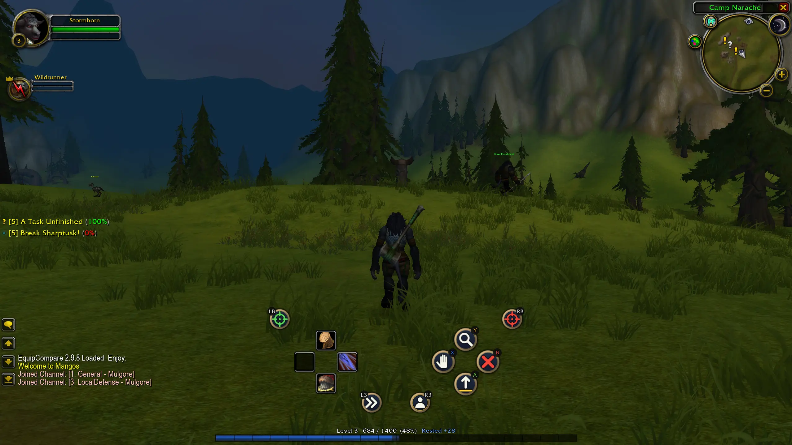

<div align="center">
  <h1>benilla, with a controller</h1>
  <p><b>A fork of <a href="https://github.com/samwhosung/benilla">benilla</a>, the from-scratch World of Warcraft 1.12.1 client in Rust and <a href="https://bevy.org">Bevy</a>, aiming at full controller support</b></p>
  <p>
    <a href="LICENSE-MIT"></a>
  </p>
  
</div>

This fork adds gamepad play to benilla: you can log in, pick a character, fight, loot, use every
game window, chat and command your bots without touching the keyboard or mouse. 1.12.1 never had
controller support, so none of this is in upstream benilla, which stays a faithful 1.12.1 client.
Everything else is upstream's work; see [About benilla](#about-benilla) below.

The controller support lives in its own crate, [`crates/benilla-pad`](crates/benilla-pad), built on
top of benilla the way upstream asks a feature 1.12.1 lacks to be built. It has two halves:

- **The pad, in Rust.** It reads the controller, moves you and the camera, and runs every button
  press as a 1.12 key binding, the path a key press takes.
- **The interface, as a 1.12 addon** (`BenillaPad`, shipped inside the binary and installed into
  `benilla-config/AddOns` at start). It draws the gamepad bar, the wheels and the menus with the
  stock 1.12 interface functions, and its art is drawn from scratch by
  [`tools/gen_art.py`](crates/benilla-pad/tools/gen_art.py).

Nothing in benilla itself is changed: the crate uses only what benilla offers a crate built on top
of it. An optional "Log in automatically" tick for the login screen, which does change benilla,
lives on the separate [`auto-login`](../../tree/auto-login) branch.

## What the controller covers

- **Before the world:** the login, realm and character screens.
- **Moving and looking:** left stick to move in eight directions, right stick for the camera,
  zoom with a shoulder held.
- **Fighting:** four layers of buttons (no trigger, LT, RT, LT+RT) on the D-pad, the face buttons,
  the shoulders and the stick clicks, 48 slots in all. Spells, items and macros sit in real 1.12
  action slots, so the server keeps them, and the bar shows cooldowns, range and mana like the
  stock bar. Druid forms, warrior stances and stealth get their own sets.
- **Interact:** one button to talk, trade, loot (everything at once), skin or attack, on your
  target or on the nearest corpse, NPC, chest, herb or mailbox in front of you.
- **Game windows:** bags, vendors, quests, trainers, mail, the auction house and the rest take the
  right stick as a mouse cursor, with the D-pad jumping between buttons.
- **Wheels:** a window wheel for every game window and emotes, a consumables wheel for potions,
  food, bandages and weapon oils, and a quest-item button.
- **Chat:** phrase tiles for every channel and an on-screen keyboard.
- **Bots:** for [cMaNGOS playerbots](https://github.com/cmangos/playerbots): log your account's
  characters in and out, command them from tiles by category, and keep your favourite orders on a
  bot wheel.
- **Setup:** an in-game keybind screen, a spell picker, bind-by-pressing-the-combo, and a settings
  menu, all driven by the controller.

While the gamepad bar is showing, the stock action bars, bags and micro menu are hidden (the pet
bar stays); unplug the controller and they come back.

## Building the client

You need what benilla needs: an English 1.12.1 client (build 5875) for the game data, a 1.12.1
server with Warden off, stable Rust and a C compiler (on Windows, the MSVC build tools the Rust
installer sets up). Any controller the operating system sees as a gamepad should work; Xbox and
PlayStation button symbols are both drawn.

**To play from the source tree**, with a link named `WoW` at the repo root pointing at your
install (or `WOW_DATA` set to its `Data` folder):

```sh
cargo run -p benilla-pad --profile play
```

**To build the standalone client**, the optimized player build with the developer tools compiled
out:

```sh
cargo build -p benilla-pad --profile ship --no-default-features
```

The binary is `target/ship/benilla-pad` (`benilla-pad.exe` on Windows). Put it in a folder of its
own with the game data beside it, either a `Data` folder or a `WoW/Data` folder (a link or
junction to your install works). It keeps its settings, addons and the controller addon in a
`benilla-config` folder beside the binary, and never writes into the install.

The server defaults to `localhost:3724`; set another from the Realmlist button on the login
screen.

## Using the controller

Plug the controller in before you start. Xbox names are used below.

**Login and character screens**

| Button | Does |
|---|---|
| A | Enter: log in, enter the world, a dialog's Okay |
| B | Escape: back, Cancel |
| D-pad up / down | Choose a character or realm |
| Y | Tab between the account and password boxes |
| Right stick, X | Move the cursor, click |

The password still needs a keyboard, or the `WOW_USER` and `WOW_PASS` environment variables, which
log in without typing. The `auto-login` branch adds a **Log in automatically** tick that saves the
login instead (in plain text, so only for a server you run).

**In the world**

| Button | No trigger | LT / RT / LT+RT held |
|---|---|---|
| Left stick | Move | Move |
| Right stick | Camera (with LB or RB held: zoom) | Camera |
| D-pad | Action slots | Action slots |
| A | Jump | Action slot (LT+RT+A: window wheel) |
| X | Interact / loot | Action slot (LT+RT+X: consumables wheel) |
| B | Back: stop targeting, stop casting, clear target | Action slot (LT+RT+B: quest item) |
| Y | Inspect | Action slot (LT+RT+Y: bot wheel) |
| LB / RB | Target nearest friend / enemy | Action slots |
| L3 / R3 | Auto run / target yourself | Action slots |
| Start | Window wheel | |
| Select | Controller menu | |

Every button on every layer can be changed. Press **Select** and open **Keybinds**: the D-pad
moves, A picks a button up and puts it down, X clears it, Y opens the spell list, and holding a
trigger shows that layer. You can also drag spells and items onto the bar with the mouse.

**In a game window** (bags, vendor, quest, loot, a Yes / No box…)

| Button | Does |
|---|---|
| Right stick | Moves the cursor |
| A / X | Left click / right click |
| D-pad | Jumps to the nearest button |
| LB / RB | Scroll up / down |
| B | Closes the window |

**In a wheel:** point with either stick, A to choose, B to close, LB / RB for pages.

**Settings** are under Select: camera speed and direction, stick dead zone, cast on press or on
release, the bar's size and place, button symbols, and switches for the cursor, the cooldown row
and the stock bars. `/pad` in chat opens the same menu.

---

# About benilla

Everything below is upstream benilla's own description, and it applies to this fork unchanged.

benilla plays the whole game: character creation, questing and professions, dungeons and raids,
battlegrounds and honor, groups, guilds, trade, mail and the auction house, on the stock 1.12
interface and with your addons. It connects to a 1.12.1 server over the original protocol and
reads the game's data from your own 1.12.1 install. Every file format, the network protocol and
the interface engine are written from scratch, with no original client code, no third-party WoW
crates and no bundled game assets.

## What's inside

- **Formats:** readers for the whole asset stack (the MPQ patch chain, BLP, DBC, ADT, WDT, WDL, M2
  and WMO), wired into Bevy as an asset source.
- **World:** terrain streamed out to the horizon, portal-culled buildings with interior lighting,
  doodads and ground clutter, swimmable water, sky and weather, and the client's own day/night
  lighting, fog and gamma.
- **Models:** GPU-skinned M2s with the full animation controller, particles, ribbons and the spell
  visuals, and characters end to end: customization, the armor composite, weapons with their
  enchant glows, forms, stealth and mounts.
- **Movement:** networked movement in both directions, the server-granted modes from slow fall to
  roots, a follow camera with collision, boats, zeppelins and taxi flights.
- **Networking:** SRP6 auth through world-session crypto and the object mirror into the ECS,
  covering the game from movement and chat through combat, spells, groups and raids, quests,
  trade, mail, the auction house and battlegrounds.
- **Interface:** a FrameXML and Lua engine that runs the stock 1.12 interface off your install's
  patch chain, and third-party 1.12 addons: Questie, pfUI, Bagnon, Bartender2 and most others
  run. By choice, the options window and the ESC menu follow the Classic Era client's rather than
  1.12's.
- **Audio:** music, ambience and effects under the client's own selection and crossfade rules,
  with interior and underwater transitions and zone reverb.

The format readers and the UI engine core are plain Rust with no Bevy in them, and the world
renderer runs with no game attached. [`docs/MAP.md`](docs/MAP.md) maps every crate and subsystem,
generated from the code.

## Status

Complete and fully playable. What is left:

- The long tail of small features that separates a working client from a finished one, tracked
  as [issues](https://github.com/samwhosung/benilla/issues).
- Addons, options and performance, ongoing.

benilla is a faithful 1.12.1 client and the foundation people build on. There are no prebuilt
downloads: a packaged build, a particular server's changes or anything 1.12.1 never had belongs
in a fork, and forks are welcome. GitHub lists
[every public fork](https://github.com/samwhosung/benilla/forks).

Not planned: other expansions or client versions, Warden (anticheat).

## Running it

benilla builds and runs on macOS, Linux and Windows. You need:

- **An English 1.12.1 client (build 5875)** for the game data. benilla only reads it.
- **A 1.12.1 server with Warden off.** [vmangos](https://github.com/vmangos/core) is what
  development runs against, and it ships with Warden off; cMaNGOS and the other 1.12.1 cores speak
  the same protocol.
- **Stable Rust and a C compiler**, because the client's Lua is built from source: on macOS the
  Xcode command line tools, on Linux the ALSA and udev development packages and pkg-config, on
  Windows the MSVC build tools that the Rust installer sets up.

```sh
WOW_DATA=/path/to/WoW/Data cargo run --release -p benilla
```

On Windows, in PowerShell:

```powershell
$env:WOW_DATA="C:\path\to\WoW\Data"; cargo run --release -p benilla
```

Each release is a tag on the [Releases page](https://github.com/samwhosung/benilla/releases):
`git checkout <tag>` first runs that release, and `main` is the development tip.

`WOW_DATA` names the install's `Data` folder; a link to the install named `WoW` at the repo root
does the same (`ln -s /path/to/WoW WoW`, or on Windows a junction, which needs no admin rights:
`New-Item -ItemType Junction -Path WoW -Target C:\path\to\WoW`). The server defaults to
`localhost:3724`, the stock auth port. Point `WOW_HOST` at another (`WOW_HOST=play.example.com`, or
`play.example.com:5000` for a remapped port), or set it from the Realmlist button on the login
screen, which remembers it. Credentials go in at the login screen, or set `WOW_USER` and `WOW_PASS`
to skip it.

Settings, screenshots and addons live in `benilla-config/` at the repo root: a 1.12 addon goes in
`benilla-config/AddOns/`. [`docs/CONTRIBUTING.md`](docs/CONTRIBUTING.md) has the rest, from the
player build to the tests.

## Contributing

Issues and pull requests are open. [`docs/CONTRIBUTING.md`](docs/CONTRIBUTING.md) says where to
start, what gets in, how a change is judged and what happens to a pull request once it is open.
Bugs, questions and ideas are welcome on the [Discord](https://discord.gg/wJSJx467G4) too.

---

Early inspiration and file format guidance came from the
[wowemulation-dev](https://github.com/wowemulation-dev) community, and
[warcraft-rs](https://github.com/wowemulation-dev/warcraft-rs) in particular.

benilla is an independent fan project, not affiliated with or endorsed by Blizzard Entertainment.
It ships **no Blizzard content**: no art, models, sounds, maps, MPQ contents or FrameXML. You
provide your own legally obtained 1.12.1 client, and the stock interface runs off its FrameXML at
runtime. The few files under `crates/benilla-app/assets/ui/` are our own, not copies of it:
adapters over stock files, and the settings windows and script error log benilla draws itself.
The controller addon and its art under `crates/benilla-pad/addon/` are this fork's own, drawn by a
script in the repo. The screenshot at the top shows the game's art as your own install renders it.

World of Warcraft is a trademark of Blizzard Entertainment, Inc. Our own code is licensed under
[MIT](LICENSE-MIT) or [Apache 2.0](LICENSE-APACHE), at your option. The two vendored components
under `third_party/`, the kira audio engine and a Lua 5.1 patched to the 1.12 client's dialect,
keep their own upstream licenses, alongside each.
